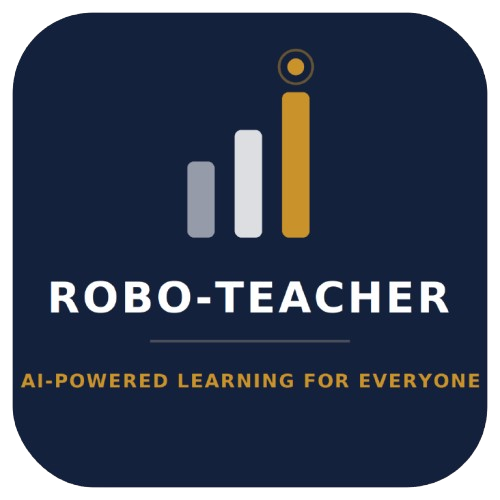
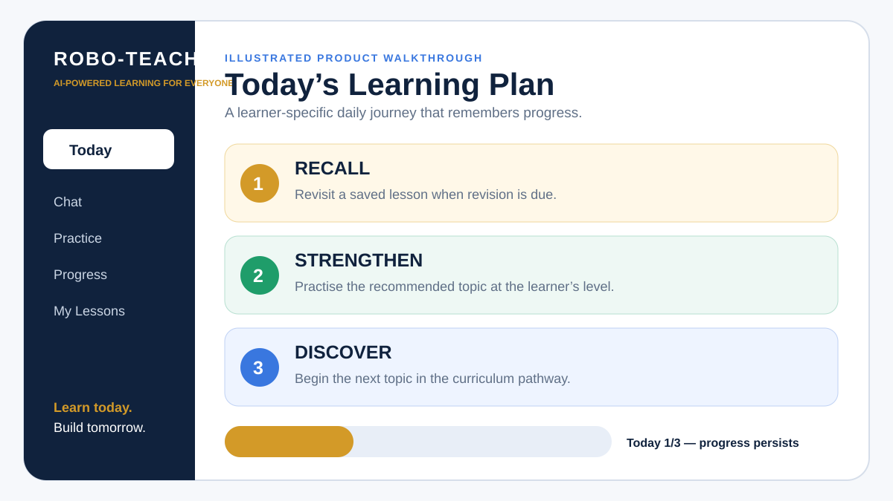
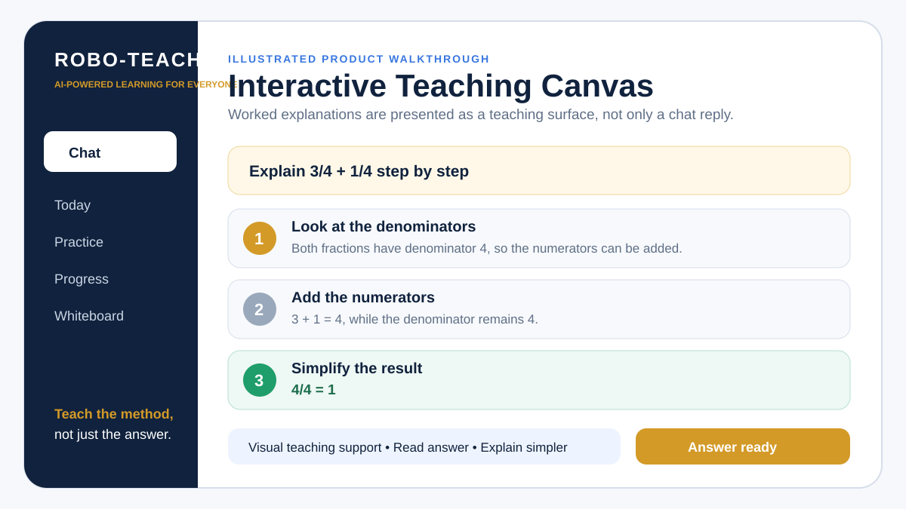
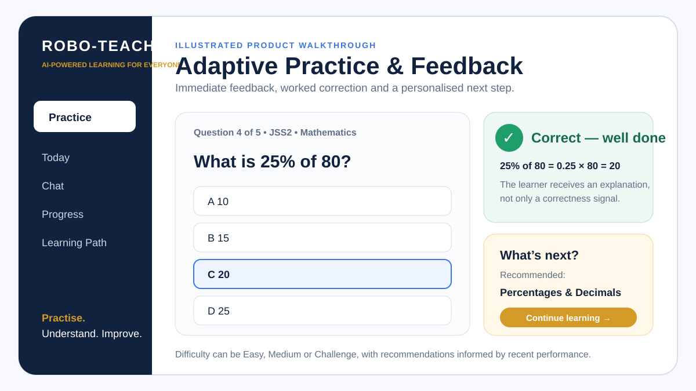
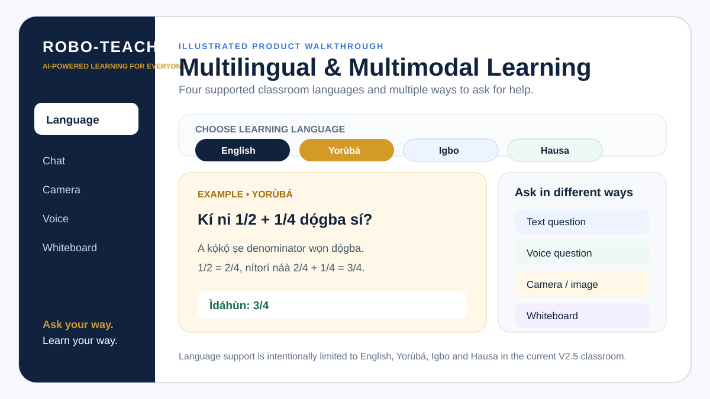

<p align="center">
  
</p>

# Robo-Teacher

<p align="center"><strong>Every learner. Their own AI teacher.</strong></p>

Robo-Teacher is a **Gemini-powered, adaptive, multilingual and multimodal Mathematics learning system for African learners**, built by **Earlyon-Tech Brainery**.

The project began as an AI tutoring pilot delivered through WhatsApp and Telegram and has evolved into a **live browser-based AI classroom for JSS1–JSS3 Mathematics**. Robo-Teacher can currently teach, practise, assess, personalize, track progress, support revision, and guide learners through a daily learning journey using text, voice, images and an interactive whiteboard.

## 🚀 Live Production Demo

**Open Robo-Teacher:**  
https://robo-teacher-jfg7.onrender.com/classroom-app

**Telegram:**  
https://t.me/RoboTeacherAfricaBot

**Staging environment:**  
https://robo-teacher-v25-staging.onrender.com/classroom-app

> **Current production status — 10 September 2026:** Robo-Teacher V2.5 is live on the production `main` branch following staging validation and production smoke testing. The verified V2.5 feature release was promoted through **PR #18** and squash-merged as code release commit `411ae06ce2608b315f628acd8136eff24c703f87`.

---

## See Robo-Teacher in Action

The following graphics are **illustrated product walkthroughs of features implemented and manually validated in Robo-Teacher V2.5**. They are not presented as screenshots of the exact current browser pixels. The **live production demo above is the source of truth for the current UI**.

### 1. Today — personalized daily learning



The Today experience guides each learner through **Recall → Strengthen → Discover**, stores completion by learner/class/local date, and supports continuation after refresh or return.

### 2. Interactive Teaching Canvas



Learners can ask a Mathematics question and receive a structured step-by-step explanation on a dedicated Teaching Canvas rather than only a final answer.

### 3. Adaptive Practice and feedback



Practice Mode gives immediate feedback, worked explanations, session results and recommended next steps, with Easy, Medium and Challenge levels.

### 4. Multilingual and multimodal learning



The current classroom supports **English, Yorùbá, Igbo and Hausa**, alongside typed questions, voice questions, camera/image input and an interactive whiteboard.

---

## 60-Second Reviewer Walkthrough

A reviewer can experience the current product without installing anything:

1. Open the **Live Production Demo** above.
2. Enter a nickname and choose **JSS1, JSS2 or JSS3**.
3. Tap **Today** to view the personalized daily plan.
4. Try the three-part journey: **Recall → Strengthen → Discover**.
5. Open **Chat** and ask a Mathematics question such as `Explain 3/4 + 1/4 step by step`.
6. Try **Practice**, **Whiteboard**, **Camera/Image**, **Voice**, or switch among **English, Yorùbá, Igbo and Hausa**.
7. Open **Progress** to view learning history and recommendations.
8. Return with the same nickname to see persisted progress and continuation guidance.

The live classroom is the clearest representation of the project's present stage.

---

## The Problem

In many public-school classrooms, one teacher may be responsible for a large number of learners with different levels of understanding. Sustained one-to-one explanation, practice, feedback and remediation can therefore be difficult.

Learners who do not understand a concept immediately may have limited opportunities to ask follow-up questions, practise at their own level, receive patient explanations, or revisit earlier concepts outside school hours.

Robo-Teacher is being developed as an **always-available AI learning layer that complements human teachers** by giving learners individualized support through accessible digital channels.

---

## What Works in V2.5 Today

### Personalized daily learning journey

The live classroom includes a **Today** system organized around three pedagogical steps:

- **RECALL** — revisit a saved lesson when revision is due;
- **STRENGTHEN** — practise a recommended topic at an appropriate difficulty;
- **DISCOVER** — begin the next topic in the learner's curriculum pathway.

Daily completion is stored by **learner, class and local date**. A returning learner can resume an unfinished activity, while a completed plan remains completed for that learner for the day.

### Step-by-step Gemini tutoring

The tutoring layer is designed to teach rather than simply return answers. It supports:

- worked, step-by-step explanations;
- misconception correction;
- simplified explanations;
- follow-up questions;
- class-level adaptation; and
- curriculum-aware teaching.

### JSS1–JSS3 curriculum-aware learning

The browser classroom currently supports **Junior Secondary School 1, 2 and 3 Mathematics**.

Practice and recommendations are class-aware and term-aware. Curriculum mapping is maintained in `curriculum.py`, while tutoring and pedagogical instructions are coordinated through the classroom and tutor layers.

### Adaptive Practice Mode

Learners can:

- select class and term;
- practise curriculum topics;
- choose **Easy, Medium or Challenge** difficulty;
- use automatic difficulty recommendations based on recent performance;
- complete 5-, 10- or 20-question sessions;
- receive immediate praise or corrective feedback;
- view worked explanations after errors;
- review missed questions; and
- receive recommendations for what to practise next.

The system is designed to avoid repeating the same generated prompt within a practice session.

### Diagnostic assessment

Robo-Teacher includes class-and-term diagnostic assessment to help identify an appropriate starting point. Diagnostic results are stored separately from ordinary Practice results so placement evidence does not distort routine practice averages.

### Multilingual learning

The classroom currently supports:

- **English**
- **Yorùbá**
- **Igbo**
- **Hausa**

The product is being developed toward simple, learner-friendly explanations rather than unnecessarily formal language, while retaining official Mathematics terminology where appropriate.

### Multimodal interaction

Learners can interact through:

- typed questions;
- camera capture;
- homework-image upload;
- voice questions;
- spoken teacher answers; and
- an interactive whiteboard.

The whiteboard includes pen, eraser, clear and **Ask Teacher** controls so learners can show mathematical working rather than only type a question.

### Teaching Canvas and AI teacher experience

Worked explanations are displayed on a large Teaching Canvas intended to behave more like a teaching surface than a conventional chatbot window.

V2.5 also includes teacher-voice playback, pause/continue controls, visual teaching pathways and an AI teacher/avatar interface.

### Saved lessons and intelligent revision

Learners can save useful explanations to **My Lessons** and revisit them later. Saved lessons can be scheduled for revision, and revision performance contributes to whether a lesson should be revisited again or treated as mastered. This functionality feeds the **Recall** stage of Today.

### Learner progress and weekly guidance

The learner dashboard can surface sessions completed, questions attempted, overall score, topic performance, strongest topic, focus area, recent activity, recommended next step, learning-path status and weekly summaries.

The learning path distinguishes states such as **Mastered**, **Needs practice**, **Recommended next** and **Not started**.

### Teacher View

Robo-Teacher includes a teacher-facing dashboard with privacy-conscious aggregate information such as class activity, performance trends, stronger and weaker topics, diagnostic placement summaries, recommended teaching attention and downloadable CSV reports.

The Teacher View is intended to help the AI **support human teachers rather than replace their professional judgment**.

---

## Product Progress: Pilot → V2.5

| Stage | What was demonstrated |
|---|---|
| **Initial pilot** | Gemini-powered JSS2 Mathematics tutoring through WhatsApp and Telegram |
| **Multimodal V2** | Text, homework-image and voice-question tutoring with adaptive learner profiles |
| **V2.5 classroom** | Browser classroom, Teaching Canvas, whiteboard, Practice Mode and multilingual learning |
| **Personalization** | Diagnostic assessment, learner progress, learning path, adaptive difficulty and Continue Learning |
| **Teacher support** | Teacher dashboard, weekly summaries, privacy-safe aggregates and CSV reporting |
| **Current production** | Daily **Recall → Strengthen → Discover** journey, persistence, revision scheduling, Welcome-back continuation and learner-isolated progress |

---

## Verified Pilot Evidence

The original evaluation involved students from **Ise Junior High School, Epe** and **Tio College, Ikorodu**, Lagos State.

| Metric | Result |
|---|---:|
| Students | **56** |
| Schools | **2** |
| Matched baseline + post-test | **56 / 56** |
| Baseline mean | **12.7%** |
| Post-test mean | **26.5%** |
| Observed gain | **+13.8 percentage points** |
| Students who improved | **51 / 56 (91.1%)** |
| Feedback respondents | **56 / 56** |
| Mean feedback rating | **4.84 / 5** |
| Successful logged interactions | **188** |
| WhatsApp interactions | **119** |
| Telegram interactions | **69** |

Recurring positive feedback themes included clear step-by-step explanations, simple language, patient/non-judgmental support, availability through familiar channels and help with homework/practice.

Learners also requested richer visuals, voice/video, local-language support, more practice, progress tracking, personalization and lower-data/offline access. Several of these requests directly shaped V2.5 development.

### Interpretation boundary

These are **descriptive pre/post pilot results**, not a randomized causal evaluation. The pilot did not use a randomized control group, so the observed improvement should **not** be interpreted as proof that Robo-Teacher alone caused the increase.

The frozen pilot evidence is deliberately kept separate from later V2.5 product-development testing.

See:

- `evaluation/PILOT_DASHBOARD.md`
- `evaluation/PILOT_EVIDENCE_RECORD.md`

Student-level data and personally identifying records are not committed to this public repository.

---

## Current Technical Architecture

```text
Learner
   │
   ├──────── Browser Classroom (V2.5)
   ├──────── Telegram
   └──────── WhatsApp migration path
                  │
                  v
          FastAPI application
       main.py / classroom_api.py
                  │
     ┌────────────┼────────────┐
     v            v            v
 Tutor layer   Practice /   Learner state,
  tutor.py     Diagnostic   progress & recs
     └────────────┼────────────┘
                  v
             Google Gemini
                  │
                  v
        Pedagogical AI response
                  │
     ┌────────────┼────────────┐
     v            v            v
 Teaching     Voice /       Google Sheets
  Canvas      visuals       pseudonymized
                            logs/progress
```

### Main technology stack

- **Python / FastAPI** — backend and authenticated API/webhook layer
- **Google Gemini** — tutoring, multimodal understanding and AI generation
- **HTML / CSS / JavaScript** — responsive V2.5 classroom
- **Google Sheets** — pseudonymized pilot, progress and evaluation records
- **Telegram Bot API** — messaging tutor
- **Twilio WhatsApp Sandbox** — original pilot channel / migration path
- **Render** — production and staging deployment
- **GitHub Actions** — automated tests and release checks

---

## Privacy and Responsible Data Use

Robo-Teacher uses **pseudonymization**, not a claim of complete anonymity.

The system separates participant identity information from interaction/progress records wherever possible. Browser learners can be represented by stable pseudonymous identifiers derived from a device-generated random key rather than requiring an email address or phone number for the browser progress feature.

Current safeguards include:

- pseudonymous learner/Pilot IDs;
- separation of roster information from interaction records;
- PII minimization for stored recent-question context;
- Telegram webhook-secret validation;
- Twilio request-signature validation;
- bounded media-download handling;
- provider-error sanitization;
- deployment secrets supplied through environment variables; and
- separation of staging and production environments.

Never commit `.env`, API keys, bot tokens, service-account JSON, student-level records or other credentials/private data to this repository.

---

## Testing and Release Discipline

Robo-Teacher uses a **staging-first release workflow**. The current V2.5 feature release was tested on the dedicated staging service before promotion.

Validation included:

- automated Robo-Teacher test workflow success on the release head;
- fresh learner onboarding;
- Today plan rendering;
- Recall/Strengthen/Discover progression;
- Practice completion and transition to Discover;
- full daily-plan completion;
- persistence after refresh/re-entry;
- returning-learner continuation;
- in-progress activity resumption;
- learner isolation on the same device;
- ordinary Chat tutoring after the daily-learning logic; and
- a final smoke test on the live production classroom after deployment.

The production service deploys automatically from `main`. Experimental work is validated on staging before production promotion.

---

## Repository Components

- `main.py` — production FastAPI application, authenticated messaging webhooks and shared classroom route
- `classroom/` — responsive V2.5 browser classroom
- `classroom/app.js` — classroom interaction, Practice, progress, learning path, saved lessons and daily-plan integration
- `classroom/daily_session.js` — learner/day-specific daily-session state and completion tracking
- `classroom/daily_guidance_fix.js` — resilient Recall/Strengthen/Discover completion guidance
- `classroom/daily_return_fix.js` — Welcome-back and unfinished-activity continuation
- `classroom_api.py` — browser session and classroom API endpoints
- `tutor.py` — Gemini orchestration, pedagogy, multilingual and multimodal tutoring
- `curriculum.py` — class/term Mathematics curriculum mapping
- `practice.py` — Practice Mode session and marking logic
- `practice_generator.py` — curriculum-aware practice generation
- `practice_progress.py` — persistent pseudonymous progress and recommendations
- `learner_profile.py` — adaptive profile and minimized recent-question memory
- `roster_sheet.py` — pilot learner recognition/onboarding
- `sheet_logger.py` — pseudonymized interaction logging
- `telegram_adapter.py` — Telegram integration
- `evaluation/` — pilot evaluation instruments and aggregate evidence
- `docs/walkthroughs/` — reviewer-facing illustrated product walkthroughs
- `.github/workflows/test.yml` — automated CI tests

---

## Run Locally

```bash
git clone https://github.com/stephenrabbi/robo-teacher-pilot.git
cd robo-teacher-pilot
pip install -r requirements.txt
cp .env.example .env
uvicorn main:app --reload
```

Then open:

```text
http://127.0.0.1:8000/classroom-app
```

For Render-style production startup:

```bash
uvicorn main:app --host 0.0.0.0 --port $PORT
```

### Typical environment variables

```env
GEMINI_API_KEY=
GEMINI_MODEL=gemini-3.1-flash-lite
GOOGLE_SHEET_ID=
GOOGLE_SERVICE_ACCOUNT_JSON=
TELEGRAM_BOT_TOKEN=
TELEGRAM_WEBHOOK_SECRET=
TWILIO_ACCOUNT_SID=
TWILIO_AUTH_TOKEN=
ALLOW_AUTO_ENROLL=false
```

Keep `ALLOW_AUTO_ENROLL=false` for controlled pilots unless enrollment is deliberately opened.

---

## Known Limitations

Robo-Teacher is a **live early-stage education technology product**, not a finished autonomous teacher.

Current limitations include:

- Gemini responses can still be incorrect or incomplete;
- voice quality/availability depends on provider capacity and browser/device support;
- image tutoring depends on image clarity;
- conversation context can be limited by service/runtime state;
- current production scope focuses on Junior Secondary Mathematics rather than all subjects or education levels;
- internet access is required for the current live experience;
- the original pilot did not include a randomized control group;
- the post-test average remained low in absolute terms despite the observed improvement; and
- Financial Mathematics was a weaker pilot topic and remains an identified improvement area.

Human teachers remain important for safeguarding, curriculum judgment, motivation, classroom relationships and interpreting learner needs beyond what the AI can infer.

---

## Roadmap

### Current — V2.5 production

- live browser AI classroom
- JSS1–JSS3 Mathematics
- English, Yorùbá, Igbo and Hausa
- text, image, voice and whiteboard learning
- adaptive Practice Mode and diagnostic placement
- learning path and progress dashboard
- saved lessons and scheduled revision
- daily **Recall → Strengthen → Discover** plan
- learner/day-specific persistence
- Welcome-back and unfinished-session continuation
- Teacher View and CSV reporting

### Next development priorities

- richer animated visual explanations;
- more reliable low-latency natural teacher voice;
- improved mid-explanation language switching;
- stronger avatar lip-sync and gesture behavior;
- more subjects and curriculum levels;
- stronger teacher analytics and intervention tools;
- lower-bandwidth access patterns;
- larger controlled school pilots; and
- more rigorous learning-effectiveness evaluation.

---

## Vision

Robo-Teacher is not intended to be another question-answer chatbot.

The long-term goal is to build an **AI teacher infrastructure layer for African education**: a system that can understand where a learner is, teach at that learner's level, switch language when necessary, show concepts visually, listen to questions, provide practice, remember progress, identify learning gaps and help human teachers see where support is needed.

**Every learner. Their own AI teacher.**

---

## About Earlyon-Tech Brainery

Earlyon-Tech Brainery is a Nigerian education-technology initiative focused on improving access to practical digital and technology-enabled learning for children, young people and educators.

Robo-Teacher represents the initiative's move from primarily human-led learning programs toward building scalable AI-powered learning infrastructure that can complement teachers and expand individualized support.
